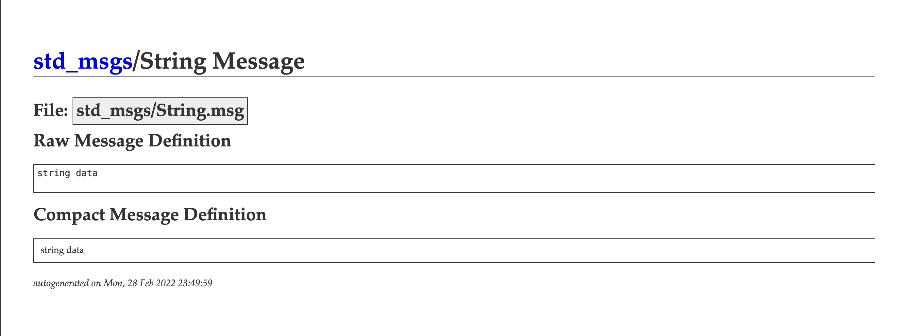
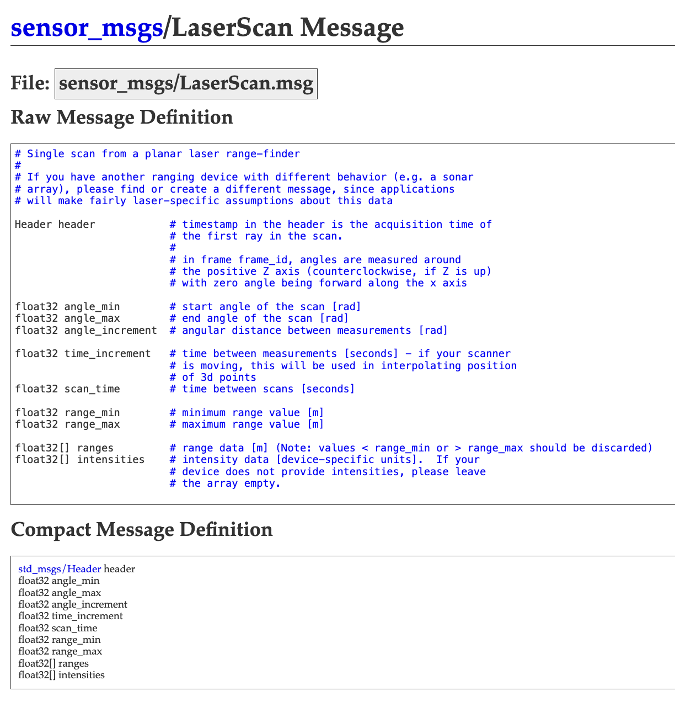
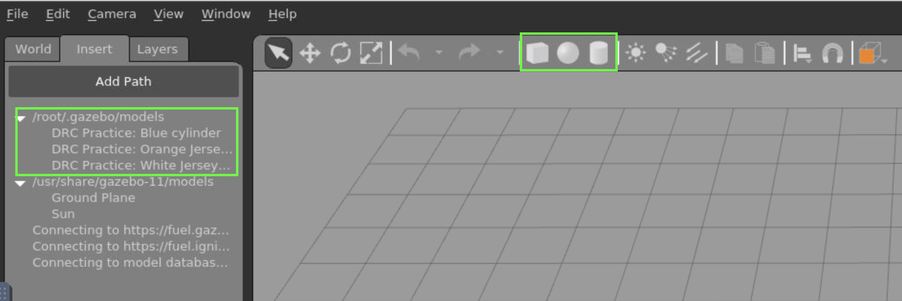
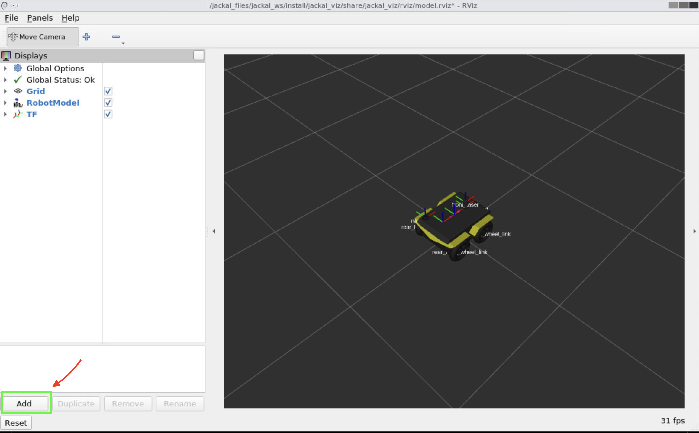
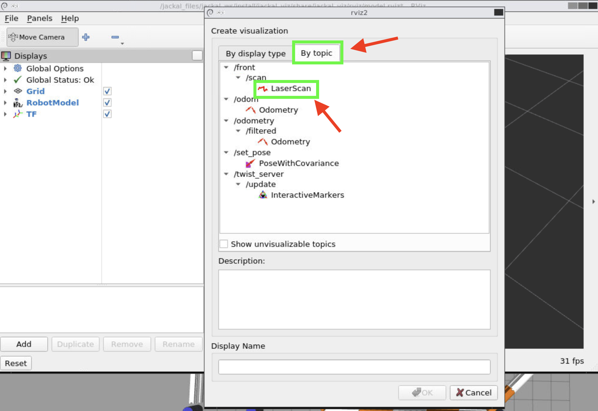

# ASME <br /> ROS Workshop
---

<!-- tell windows users to launch wsl every time they open a new window -->

## Prequisites
- Text editor
- Terminal emulator
- Github repository open in browser

---

<style scoped>
h2 {
    text-align: center;
    position: unset;
    color: white;
}
</style>
## Make Robot Hard.

---

# What's ROS?


---
<style scoped>
h2 {
    text-align: center;
    position: unset;
    color: white;
}
</style>

## It's not an actual OS

---

<style scoped>
h2 {
    text-align: center;
    position: unset;
    color: white;
}
</style>
## A set of software frameworks for robot software development

---
<!-- Explain wtf is ros2 and what is difference and all --->

<!-- Node is modular -->
## Why use ROS?

- A lot of prebuilt packages
- Modular
- Open-source

---

## Nodes
- An executable program or a running process that performs some kind of task
- A single node is responsible for a single, modular task
---
## Ways to communicate
- Publisher - Subscriber
- Services
- Actions
---

## Publisher - Subscriber

<!-- - Transfer data via topics in the form of messages -->
<style>
img[alt~="center"] {
  display: block;
  margin: 0 auto;
}
</style>


<!-- fix gif not working -->
---
## Messages
### [std_msgs](http://docs.ros.org/en/melodic/api/std_msgs/html/msg/String.html)


---
### [sensor_msgs](http://docs.ros.org/en/melodic/api/sensor_msgs/html/msg/LaserScan.html)



---

## ROS Workspaces

<!-- Talk about diff projects have diff workspaces coz have diff packages so no conflict source thanks -->

- Directory containing ROS2 packages
- Sourcing the installation workspace to have the packages in that workspace available to you  `source ./install/local_setup.bash`

- 3 types of workspaces
    - Python
    - C++
    - Python & C++
---

### Python Workspace
```
ros_ws/
├── build/
│   └── ...
├── install/
│   └── ...
├── log/
│   └── ...
└── src/
    └── my_package/
        ├── package.xml
        ├── resource/my_package
        ├── setup.cfg
        ├── setup.py
        └── my_package/
            └── package.py
```
---

### C++ Workspace
```
ros_ws/
├── build/
│   └── ...
├── install/
│   └── ...
├── log/
│   └── ...
└── src/
    ├── CMakeLists.txt
    ├── include/my_package/
    ├── package.xml
    └── src/
        └── my_package.cpp
```

---
<style scoped>
h1 {
    font-size: 1.5rem;
}
</style>

### Python & C++
```
ros_ws/
├── build/
│   └── ...
├── install/
│   └── ...
├── log/
│   └── ...
└── src/
    └── my_package/
        ├── CMakeLists.txt
        ├── package.xml
        ├── include/
        │   └── header_file.hpp
        ├── src/
        │   └── my_package.cpp
        ├── my_package/
        │   └── module_to_import.py
        └── scripts/
            └── my_package.py
```
---
## What's a package?
- Organisational unit for ROS code
- Makes it easier to share your ROS work with others
---


# Some Terminal Stuff

<!--- Now, we'll get into some actual hands on stuff. Head over to the GitHub Repo and open up your terminals. If anyone needs help, feel free to ask any one of us. --->


---
### General Command Line Tools

```sh
cd <folder/path_to_folder> # Change Directory
cd ~/Documents # Example (~/ describes your home directory)

ls # List files

mv <path_to_file> <path_to_new_location> # Move
mv ~/Downloads/file_to_be_moved ~/Documents/ # Example

cp <path_to_file> <path_to_new_location> # Copies files or folders 

mkdir <folder_name> # Make Directory a.k.a Creates a new folder
mkdir ~/new_folder/ # example

touch <file_name> # Creates a blank file
touch new_file_name # Example
```
> NOTE: Use `CTRL+C` to interrupt a running process
---
## Building a ROS2 package

<!-- Havent introduced packages yet. Should probs do it in the beginning with qorkspaces etc -->

<!--- Flow should be theory pract theory prac not theory theory theory pract pract pract -->

<!-- ASK THEM TO BE IN THE GITHUB_DIR THEN DO THIS -->
```sh
mkdir -p /jackal_files/github_dir/ros_ws/src
cd /jackal_files/github_dir/ros_ws/src
source /opt/ros/foxy/setup.bash
ros2 pkg create --build-type ament_python pub_sub 
```
> NOTE: pub_sub can be changed to any name you want

---

## Minimal Publisher

<!-- Go to your text editor and open up the part_1 folder you'll see a folder called python_scripts. Open it up and view the minimal_publisher.py code -->

<!-- ## Imports -->

```python
import rclpy
from rclpy.node import Node

from std_msgs.msg import String
```
<!-- - Importing rclpy to be able to use the Node class
- Importing pre-built String message type -->

---
<!-- ## Class initialisation -->

```python
class MinimalPublisher(Node):

    def __init__(self):
        super().__init__('minimal_publisher')
        # TODO: Replace <topic_name> with desired topic name
        self.publisher_ = self.create_publisher(String, '<topic_name>', 10)
        # TODO: Replace <period> with desired timer period in seconds
        timer_period = <period>  # seconds
        self.timer = self.create_timer(timer_period, self.timer_callback)
        self.i = 0
```
<!-- - Create `MinimalPublisher` class which inherits from parent class Node
- Call parent class init method
- Initialise publisher and timer callback -->

---

<!-- ## Timer callback -->

```python
    def timer_callback(self):
        msg = String()
        # TODO: Replace <custom_msg> with desired message or uncomment the line below
        # msg.data = 'Hello World: %d' % self.i
        msg.data = '<custom_msg> %d' % self.i
        self.publisher_.publish(msg)
        self.get_logger().info('Publishing: "%s"' % msg.data)
        self.i += 1
```
<!-- - Create String object
- Assign the desired message
- Publish the message
- Print debugging messages -->
---

<!-- ## Main -->

```python
def main(args=None):
    rclpy.init(args=args)

    minimal_publisher = MinimalPublisher()

    rclpy.spin(minimal_publisher)

    # Destroy the node explicitly
    # (optional - otherwise it will be done automatically
    # when the garbage collector destroys the node object)
    minimal_publisher.destroy_node()
    rclpy.shutdown()

if __name__ == "__main__":
    main()
```
<!-- - rclpy library initialised
- Node object MinimalPublisher() created
- Then spin the node -->

<!-- Look up what __name__ does and add info here (only explain if someone asks) --->
---
## Minimal Subscriber

```python
import rclpy
from rclpy.node import Node

from std_msgs.msg import String
```
<!-- - Same libraries as the publisher node -->

---
<!-- ## Initialisation -->

```python
class MinimalSubscriber(Node):

    def __init__(self):
        super().__init__("minimal_subscriber")
        # TODO: replace '<topic_name>' with desired topic name
        self.subscription = self.create_subscription(
            String, "<topic_name>", self.listener_callback, 10
        )
        self.subscription  # prevent unused variable warning

    def listener_callback(self, msg):
        self.get_logger().info('I heard: "%s"' % msg.data)
```
<!-- - Subscriber created instead of publisher
- Subscriber creates a callback that is run everytime a message is received
- Callback prints the message to the terminal -->
---
<!-- ## Main -->

```python
def main(args=None):
    rclpy.init(args=args)

    minimal_subscriber = MinimalSubscriber()

    rclpy.spin(minimal_subscriber)

    # Destroy the node explicitly
    # (optional - otherwise it will be done automatically
    # when the garbage collector destroys the node object)
    minimal_subscriber.destroy_node()
    rclpy.shutdown()


if __name__ == "__main__":
    main()
```
<!-- - Code does the same thing as the publisher -->

---

## Copy code to the package directory
```sh
cd pub_sub/pub_sub
cp ~/jackal_files/github_dir/part_1/python_scripts/* ./
```

---

## Modifying setup.py

### Copy the file into the package directory
```sh
cd /jackal_files/github_dir/
cp part_1/setup.py ros_ws/src/pub_sub/
```
---
### Or add these lines to the `setup.py` file in the package directory
```python
import os # Added
from glob import glob # Added
from setuptools import setup
```

```python
    entry_points={
        "console_scripts": [
            "minimal_publisher = pub_sub.minimal_publisher:main", # Added
            "minimal_subscriber = pub_sub.minimal_subscriber:main", # Added
        ],
```

---

## Building the ROS Workspace
```sh
cd /jackal_files/github_dir/ros_ws/
colcon build
```


```
ros_ws/
├── build/
├── install/
├── log/
└── src/
```
---

## Running the nodes

### Using ros2 run

```sh
source /opt/ros/foxy/setup.bash
source ./install/local_setup.bash
ros2 run pub_sub minimal_publisher.py
```
> NOTE: To run the subscriber just replace minimal_publisher with minimal_subscriber
### Executing it directly
```sh
cd /jackal_files/github_dir/ros_ws/src/pub_sub/pub_sub
python3 minimal_publisher.py 
```
> NOTE: Same thing applies here
---


<!--- Explain what launch files are
main thing to note here is that the motivation is clear (why??)
 --->

<!-- Robot software stack become big so startup robot need to run a lot of nodes so use launch file save time ez win -->

## What are launch files?

- Used to run many nodes at the same time using one command `ros2 launch ...`

---
## Writing launch files


- Python
- YAML
- XML

---
### Python

```python
from launch import LaunchDescription
from launch_ros.actions import Node


def generate_launch_description():
    return LaunchDescription(
        [
            Node(
                package="pub_sub",
                executable="minimal_publisher",
            ),
            Node(
                package="pub_sub",
                executable="minimal_subscriber",
            ),
        ]
    )
```

---
### YAML
```yaml
launch:

- node:
    pkg: "pub_sub"
    exec: "minimal_publisher"

- node:
    pkg: "pub_sub"
    exec: "minimal_subscriber"

```
---
### XML
```xml
<launch>
  <node pkg="pub_sub" exec="minimal_publisher"/>
  <node pkg="pub_sub" exec="minimal_subscriber"/>
</launch>
```

---

### Copy the launch folder
```sh
cp -r /jackal_files/github_dir/part_1/launch/ /jackal_files/github_dir/ros_ws/src/pub_sub/
```
### Edit setup.py file in the package directory
```python
    data_files=[
        ('share/ament_index/resource_index/packages',
            ['resource/' + package_name]),
        ('share/' + package_name, ['package.xml']),
        (os.path.join('share', package_name, 'launch'), glob(os.path.join('launch', '*launch.[pxy][yma]*'))) # Add
    ],
```
> Skip this step if you copied the `setup.py` file earlier

---
### Rebuild the workspace
```sh
cd /jackal_files/github_dir/ros_ws/
colcon build
```
### Running the launch file
```sh
source /opt/ros/foxy/setup.bash
source ./install/local_setup.bash
ros2 launch pub_sub launch.py 
```
> NOTE: file extension depends on which launch file you want to use (launch.xml/launch.yaml)

---
<style scoped>
h1 {
    font-size: 3.5rem;
    text-align: center;
    top: 275px
}
</style>

# Simulations

---

## Why
<!-- Why simulators? The fact that a lot of simulators support ros (?). Whats jackal (very brief) -->
<!-- What's gazebo and why (brief) -->

- Expensive and time consuming to test on physical robot
- Jackal is an open source, robotic platform which is built on ROS and Gazebo
- Gazebo is a simulation software not made specifically for ROS but can be used with it

---

## Commands to run sim and teleop

<!-- Verbally explain what teleop is -->

### Move the jackal_ws into the github directory
```sh
mv /jackal_files/jackal_ws/ /jackal_files/github_dir
cd /jackal_files/github_dir/jackal_ws
rm -rf build/ install/ log/
colcon build
```
### Launch the jackal simulator
```sh
source /opt/ros/foxy/setup.bash
source ./install/local_setup.bash
ros2 launch jackal_gazebo jackal_world.launch.py
```
---
### Run the pre-built teleop node
```sh
ros2 run teleop_twist_keyboard teleop_twist_keyboard
```

---

## Build map in gazebo

1. Launch gazebo
2. Place models or shapes

3. Then save the file by navigating to `File > Save World As` and name it `custom_world.world`. 
Then save it at this directory `/jackal_files/jackal_ws/src/jackal_simulator/jackal_gazebo/worlds/`

---

## Use newly built map

<!-- provide the path -->
<!--- always remember to explain why tf were doing all this -->

<!-- test out algos in different types of maps to see robust or not blah bal -->

### Copy the launch file and rename it 
```sh
 cd /jackal_files/jackal_ws/src/jackal_simulator/jackal_gazebo/launch/
 cp jackal_world.launch.py custom_world.launch.py
```
### Edit the launch file

```python
def generate_launch_description():

    world_file = PathJoinSubstitution(
        [FindPackageShare('jackal_gazebo'),
        'worlds',
        'custom_world.world'], # Changed
    )
```
---
### Rebuild the workspace
```sh
cd jackal_files/github_dir/jackal_ws/
colcon build
```
> Make sure you're at the root of the workspace `jackal_ws/`

### Launch the new file
```sh
source ./install/local_setup.bash
ros2 launch jackal_gazebo custom_world.launch.py
```
---

<style scoped>
h1 {
    font-size: 3.5rem;
    text-align: center;
    top: 275px
}
</style>

# Debugging
<!-- motivation: problem when build; need good tools to solve problem. how ros provide good tool and how we use them? --->

---

## Looking at topics and messages

```sh
ros2 topic echo <topic_name>
ros2 topic hz <topic_name>
ros2 topic info <topic_name>
```
---
### geometry_msgs/Twist
```sh
ros2 topic echo /cmd_vel
```
```sh
linear:
  x: 0.5
  y: 0.0
  z: 0.0
angular:
  x: 0.0
  y: 0.0
  z: 0.0
```
---
### sensor_msgs/LaserScan
<!-- what's laserscan? whats angle_increment? -->

```sh
ros2 topic echo /front/scan
```
```sh
header:
  stamp:
    sec: 1541
    nanosec: 197000000
  frame_id: front_laser
angle_min: -2.3561899662017822
angle_max: 2.3561899662017822
angle_increment: 0.006554075051099062
time_increment: 0.0
scan_time: 0.0
range_min: 0.10000000149011612
range_max: 30.0
ranges:
- 3.672072410583496
- ...
```
---
### nav_msgs/Odometry
<!-- same comment as laserscan -->
```sh
ros2 topic echo --no-arr /odom
```
### Header
```sh
header:
  stamp:
    sec: 1712668434
    nanosec: 829049376
  frame_id: odom
child_frame_id: base_link
```
---
### Pose
<!-- same comment as laserscan -->
```sh
pose:
  pose:
    position:
      x: 2.1441852005195785
      y: 1.408813177853442
      z: 0.0
    orientation:
      x: 0.0
      y: 0.0
      z: 0.06435134457900855
      w: 0.9979273041914796
  covariance: '<array type: double[36]>'
```
---
### Twist
<!-- same comment as laserscan -->
```sh
twist:
  twist:
    linear:
      x: 3.7634551129476595e-06
      y: 0.0
      z: 0.0
    angular:
      x: 0.0
      y: 0.0
      z: -1.3571082599241658e-08
  covariance: '<array type: double[36]>'
```
---

```sh
ros2 topic hz /front/scan
```
```sh
average rate: 49.326
	min: 0.019s max: 0.023s std dev: 0.00080s window: 51
```
---

```sh
ros2 topic info /front/scan
```
```sh
Type: sensor_msgs/msg/LaserScan
Publisher count: 1
Subscription count: 0
```

---
## Visualize LaserScan in Rviz

### Jackal View Model
```sh
ros2 launch jackal_viz view_model.launch.py
```



---




---

<style scoped>
h1 {
    font-size: 3.5rem;
    text-align: center;
    top: 275px
}
</style>

# Examples

---

## Local Planners

- Hueristic-based planning
- Rule-based planning

---

## wall_follow

### Run wall_follow in jackal sim
<!-- Navigate to part_4 folder -->

```sh
python3 wall_follow.py
```

---

<!-- # Run Bug0

## Run Bug0 in jackal sim

--- -->

## Additional resources (and References)
### [ros2 (foxy) tutorials](https://docs.ros.org/en/foxy/Tutorials.html)
> Note ros2 foxy is EOL
### [jackal](https://clearpathrobotics.com/assets/guides/foxy/jackal/index.html)

### F1Tenth Team